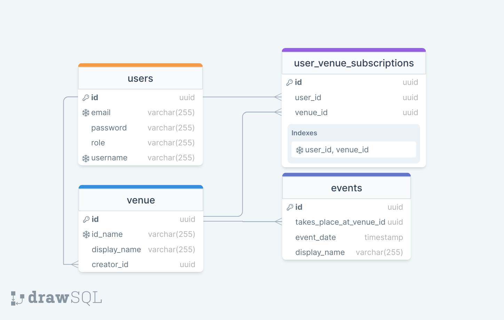

# Venue application REST API
## Описание
Данный проект реализует приложение, необходимое для взаимодействия различных заведений (клубы, бары) с посетителями. 
## Модель данных

## Стек технологий
### Безопасность
- [Spring Security](https://spring.io/projects/spring-security/)
- [JWT Token Authentication](https://jwt.io/)
### Хранение данных
- [PostgreSQL](https://www.postgresql.org/)
- [Spring Data JPA](https://spring.io/projects/spring-data-jpa)
- [Flyway DB migrations](https://flywaydb.org/)
### Сервер
- [Java 17](https://www.java.com/)
- Spring Web
### Тестирование
- [JUnit 4](https://junit.org/junit4/)
- [WebTestClient](https://docs.spring.io/spring-framework/reference/testing/webtestclient.html)
- [Mockito](https://site.mockito.org/)
### Документация
- OpenAPI Swagger
### Сборка и запуск
- [Docker](https://www.docker.com/)
- Maven
## Документация API
- [Документация в формате HTML](index.html)
- [OpenAPI документация в формате JSON](docs.json)
## Инструкция к запуску
### Через Docker
Запустите из корня приложения следующие консольные команды:
```
./mvnw clean package -DskipTests
docker compose up
```
### Самостоятельно
- Запустите PostgreSQL сервер в соотвтетствии с [конфигурацией]([application.properties](src%2Fmain%2Fresources%2Fapplication.properties)). Стандартно ожидается, что будет создана база данных "venue" на PostgreSQL сервере с портом 5432. Имя пользователя - postgres, пароль - 123.
- Запустите Java-приложение удобным для вас способом. К примеру, через IntelliJ IDEA, или собрав и запустив проект самостоятельно:
```
./mvnw clean package -DskipTests
java -jar ./target/venue-0.0.1-SNAPSHOT.jar
```
После запуска вы можете взаимодействовать с API через Swagger по ссылке http://localhost:8080/swagger-ui/index.html